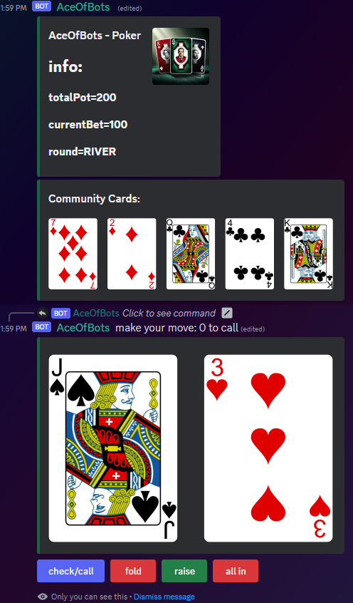
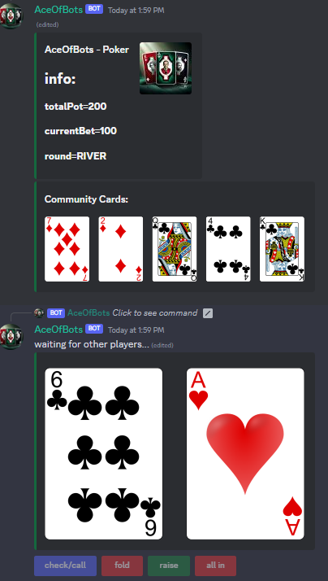

# AceOfBots
### by [Luis Brose](https://github.com/LuisBrose)
AceOfBots is a Discord Bot, which can be used for playing Texas hold 'em in a text channel with up to eight people.
## Gameplay
 

## Setup
...
### Commands
#### /play
to start a new Game of Poker
#### /join
you join the current Poker match
#### /leave
you leave the current Poker match
...
